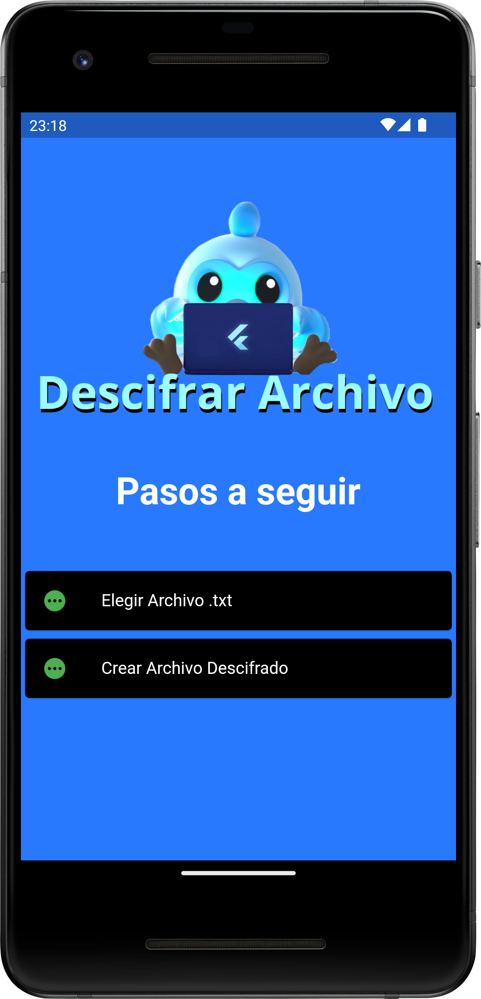

 


# Encryptable DES
An android application to encrypt messages using DES algorithm
# Platform Tested Compatibility

- [x] android

# Dependencies
All plugins used on this project
```
dependencies :
  flutter_launcher_icons: ^0.11.0

```

# Permissions
All permissions required for this application
```

```

# Screens
```
Home Screen
```


```
Encryption
```


```
Decryption
```



